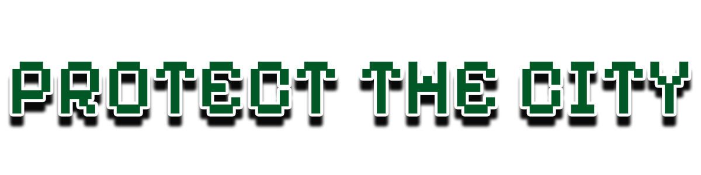

<!-- Project Shields --->
[![MIT License][license-shield]][license-url]
[![LinkedIn][linkedin-shield]][linkedin-url]

<!-- PROJECT LOGO -->
 

  

  <h3 align="center">Protect The City</h3>

  

    Protect Your City from Invasion
     
    <strong>Assignment for Game Development Module during my BSc in Computer Science @ University College Dublin</strong>
     
     
    <a href="hthttps://github.com/brendan-sadlier/protect-the-city/issues">Report Bug</a>
    ·
    <a href="https://github.com/brendan-sadlier/protect-the-city/issues">Request Feature</a>
  

<!-- ABOUT THE PROJECT -->
## About The Project

[![Product Name Screen Shot][product-screenshot]](#readme-top)

Protect The City is a Co-op 2D game built using Java.

Players must shoot down the incoming enemy missiles to protect their city. They must be careful not to run out of bullets or let the enemy missiles hit the city.

(<a href="#readme-top">back to top</a>)

### Built With

  

(<a href="#readme-top">back to top</a>)

<!-- Credits -->

## Credits

| Asset Type             | Link                                                                |
| ----------------- | ------------------------------------------------------------------ |
| **Backgrounds** | [DALL-E 3](https://openai.com/dall-e-3) |
| **Sprites** | [kenny.nl](https://www.kenney.nl/assets/tanks) |
| **Sound Effects** | [Pixabay](https://pixabay.com/sound-effects/) |
| **Other UI Assets** | [Brendan Sadlier](https://github.com/brendan-sadlier) |

(<a href="#readme-top">back to top</a>)

<!-- LICENSE -->
## License

Distributed under the MIT License. See `LICENSE.txt` for more information.

(<a href="#readme-top">back to top</a>)

<!-- CONTACT -->
## Developer

**Brendan Sadlier** - *Final Year in BSc of Computer Science @ University College Dublin* - brendan.sadlier@ucdconnect.ie

(<a href="#readme-top">back to top</a>)

<!-- MARKDOWN LINKS & IMAGES --->
[license-shield]: https://img.shields.io/github/license/othneildrew/Best-README-Template.svg?style=for-the-badge
[license-url]: https://csgitlab.ucd.ie/brendan-sadlier/fyp_algopic/blob/master/LICENSE.txt
[linkedin-shield]: https://img.shields.io/badge/-LinkedIn-black.svg?style=for-the-badge&logo=linkedin&colorB=0A66C2
[linkedin-url]: https://www.linkedin.com/in/brendan-sadlier-24672823a
[product-screenshot]: https://placehold.co/1000x600?text=Product+Screenshot+Here
